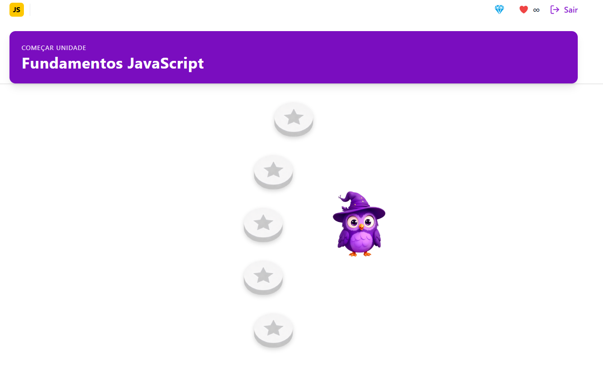
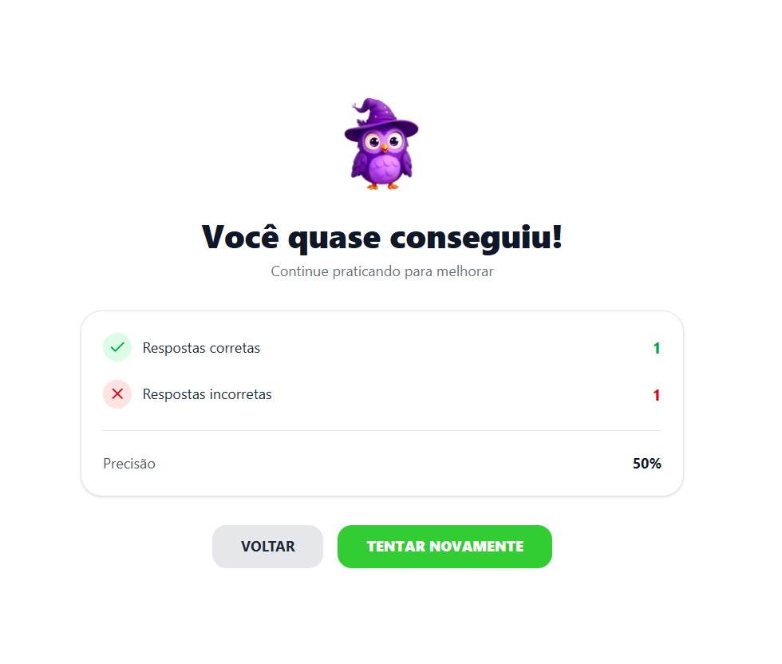

# 🟨 Devlingo — Aprenda Programação como no Duolingo

> Uma plataforma gamificada para aprender **JavaScript** e conceitos de desenvolvimento — com XP, lições, feedback visual e trilha de progresso.

🔗 **Acesse o projeto:** [https://devlingo-ten.vercel.app/login](https://devlingo-ten.vercel.app)

---

## 📸 Prévia do Projeto

### ⏳ Carregamento


### 🏠 Tela de Login


### 📚 Trilha de Lições



### ⭐ Sistema de Conclusão



### 📖 Tela da Lição


---

## ✨ O que é o Devlingo?

O **Devlingo** é uma plataforma educacional inspirada no Duolingo, mas criada para **desenvolvedores iniciantes** aprenderem JavaScript e lógica de forma divertida e progressiva.

A aplicação possui:

✔ Gamificação
✔ Lições organizadas
✔ Feedback imediato
✔ Progresso salvo
✔ Trilha visual interativa
✔ Mascote próprio
✔ Sistema de login / cadastro
✔ Integração com Supabase

---

## 🎮 Funcionalidades Principais

### 📌 1. Autenticação

* Login e cadastro com Supabase
* Rotas protegidas `ProtectedRoute`
* Persistência de sessão

### 📌 2. Módulos e lições

* Lições mockadas através do arquivo `lessonsData.ts`
* Cada lição possui:

  * Pergunta
  * Alternativas
  * Resposta correta
  * Pontuação

### 📌 3. Sistema de feedback

* Pop-up de acerto/erro
* Mensagens personalizadas
* Animações visuais

### 📌 4. Trilha de aprendizado

* Mapa de módulos (type: node-based)
* Estrelas que indicam progresso
* Travamento de lições ainda não concluídas

### 📌 5. Salvamento de progresso

* Progresso salvo automaticamente no banco via:

  ```ts
  saveLessonsScore()
  ```
* Usuário pode sair e continuar de onde parou

### 📌 6. UI moderna

* Mascote Devlingo em pixel-art
* Tela de loading animada
* Padrão visual próprio inspirado no Duolingo

---

## 🛠️ Tecnologias Utilizadas

| Tecnologia       | Uso                              |
| ---------------- | -------------------------------- |
| **React + Vite** | Base da aplicação / renderização |
| **TypeScript**   | Tipagem e segurança              |
| **CSS**          | Estilização completa             |
| **Supabase**     | Auth e persistência dos dados    |
| **Node.js**      | Ambiente de execução             |
| **React Hooks**  | Contextos e estados globais      |

---

## 📁 Estrutura do Projeto

```
devlingo/
├── public/
│   └── vite.svg
├── src/
│   ├── assets/
│   │   └── images/
│   ├── components/
│   ├── contexts/
│   ├── hooks/
│   ├── mocks/
│   ├── pages/
│   ├── services/
│   ├── styles/
│   ├── App.tsx
│   └── main.tsx
├── index.html
├── package.json
├── tsconfig.json
└── vite.config.ts
```

---

## ▶️ Como rodar o projeto localmente

### 1️⃣ Clone o repositório

```bash
git clone https://github.com/SEU-USUARIO/devlingo.git
```

### 2️⃣ Instale as dependências

```bash
npm install
```

### 3️⃣ Configure o Supabase

Crie um arquivo:

```
.env
```

E adicione suas keys:

```
VITE_SUPABASE_URL=...
VITE_SUPABASE_ANON_KEY=...
```

### 4️⃣ Execute o projeto

```bash
npm run dev
```

Acesse:

```
http://localhost:5173
```

---

## 🎯 Objetivo do Projeto

O Devlingo foi criado para:

* Treinar **lógica de programação**
* Ensinar desenvolvedores iniciantes de forma leve e gamificada
* Criar uma interface visual amigável e intuitiva
* Servir como **projeto de portfólio profissional**

---

## 🧑‍💻 Autor

Desenvolvido por **Ylgner Witoszynski**
Focado em front-end, experiências educativas e interfaces gamificadas.
